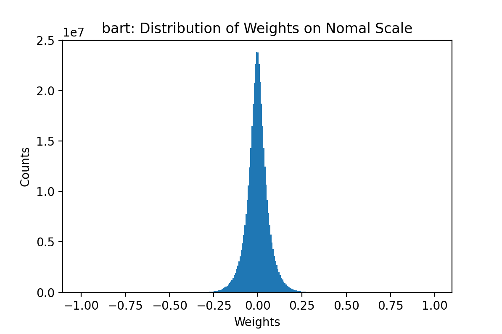
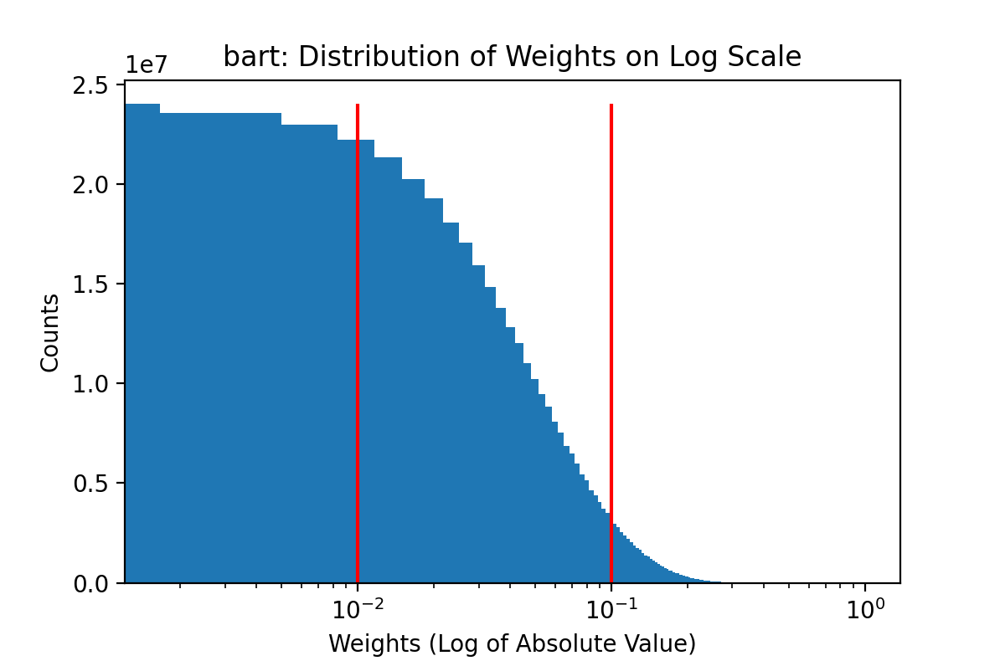
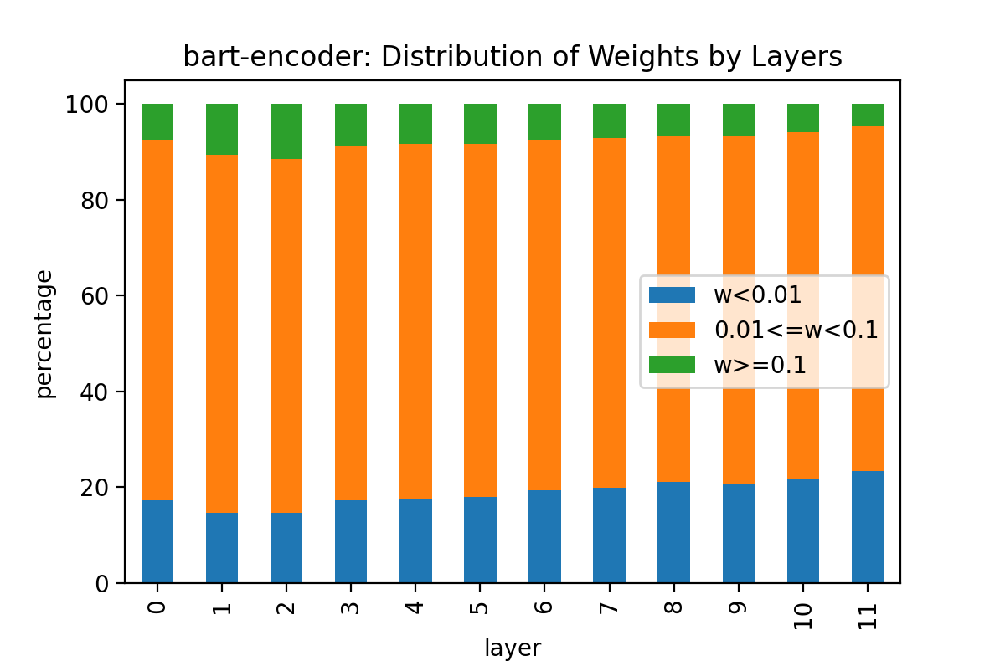
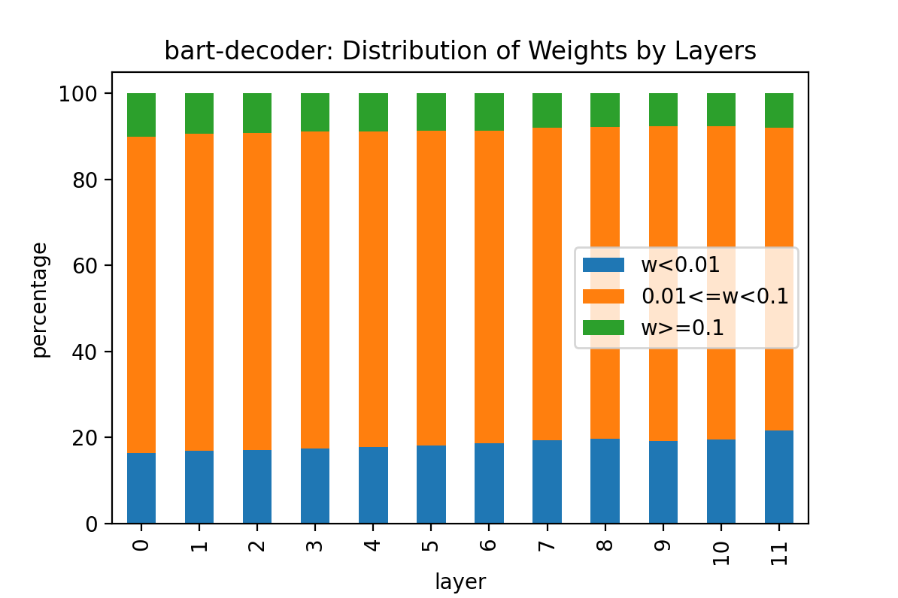
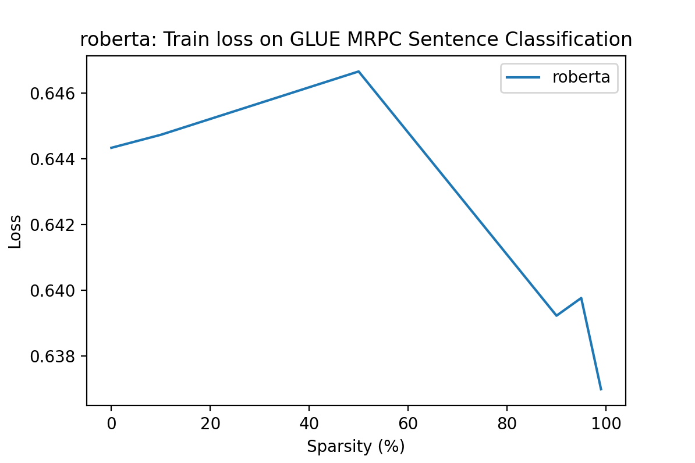
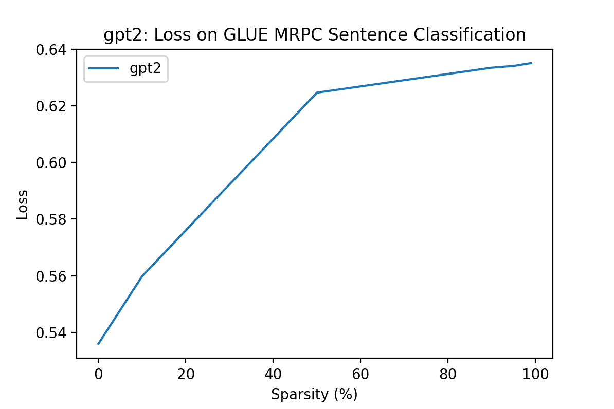
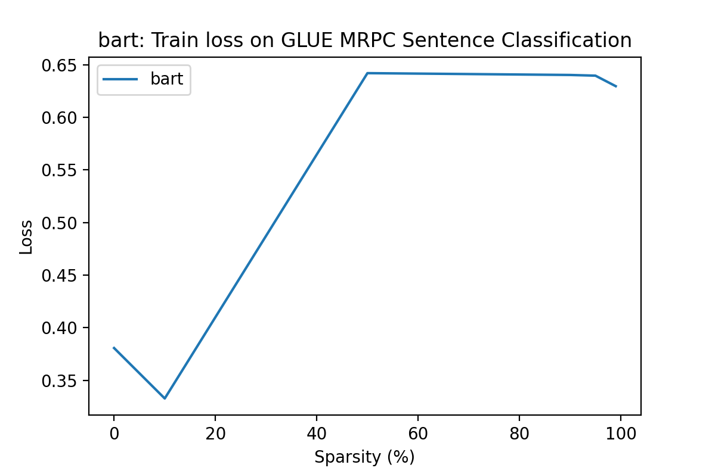

# LAB 4: LLM Sparsity

## Model Selection
* Encoder-Only: RoBERTa
* Decoder-Only: GPT-2
* Encoder-Decoder: BART

## Sparsity Structure Assessement

`sparsity_analysis.ipynb` provides code resource for this assessment.

### Distribution of Weights

This section studies the disitribution of weights on selected models.

#### RoBERTa

The weights of RoBERTa is normally distributed. Overall, around 90% of weights are less than 0.1, with about 20% of weights less than 0.01. The rest 10% of weights are greater than 0.1.

This pattern is reflected on each layer's sparsity structure while we observed a trend that as layer proceeds, the percentage of weights greater than 0.1 slightly decreases while the percentage of weights less than 0.01 slightly increases.

#### GPT-2

The weights of GPT-2 is normally distributed. Overall, around 58% of weights are less than 0.1, with about 7% of weights less than 0.01. The rest 42% of weghts are greater than 0.1.

This pattern is reflected on each layer's sparsity structure while we observed a trend that as layer proceeds, the percentage of weights greater than 0.1 slightly increases while the percentage of weights between 0.01 and 0.1 slightly decreases.

#### BART

The weights of BART is normally distributed. Overall, around 90% of weights are less than 0.1, with about 17% of weights less than 0.01. The rest 10% of weghts are greater than 0.1.

This pattern is reflected on each encoder layer's sparsity structure while we observed a trend that as layer proceeds, the percentage of weights greater than 0.1 slightly decreases while the percentage of weights less than 0.01 slightly increases. The distribution of weights per decoder layer is relatively stable. That is, the percentage of weights on each threshold doesn't change much across decoder layers.

## Sparsifying Models

`sparsify_models.py` provides code resource for the sparsification.

The selected models are sparsified based on required levels: [10%, 50%, 90%, 95%, 99%]. The [unstructured global pruning](https://pytorch.org/docs/stable/generated/torch.nn.utils.prune.global_unstructured.html) method is applied for the sparsification. As we observed that the selected 3 models follow similar pattern of weights distribution per layer, global pruning method should be proper in this setting.

## Benchmarks

### GLUE
The first benchmark performed is [GLUE, the General Language Understanding Evaluation](https://huggingface.co/datasets/glue), on MRPC (The Microsoft Research Paraphrase Corpus). This task aims to test a model's ability to correctly classify a sentence pair if they have the same meaning. 

For RoBERTa, the loss increases as the model sparsity goes up to 50%. After that, the loss decreases as the model sparsity continues going up.

For GPT2, the loss increases in general as the model sparsity goes up. However, the growth speed of loss slows down as the model sparsity goes over 50%.

For BART, the loss increases as the model sparsity goes up to 50%. After that, the loss becomes stable as the model sparsity continues going up.

## Model Size and Runtime

## Challenges of Sparsification