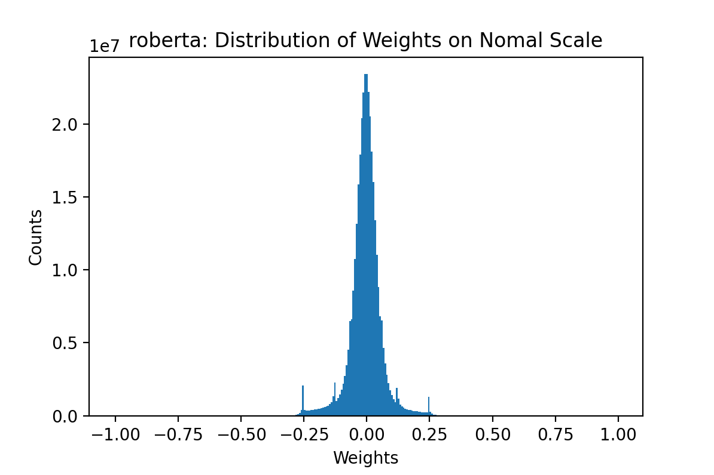
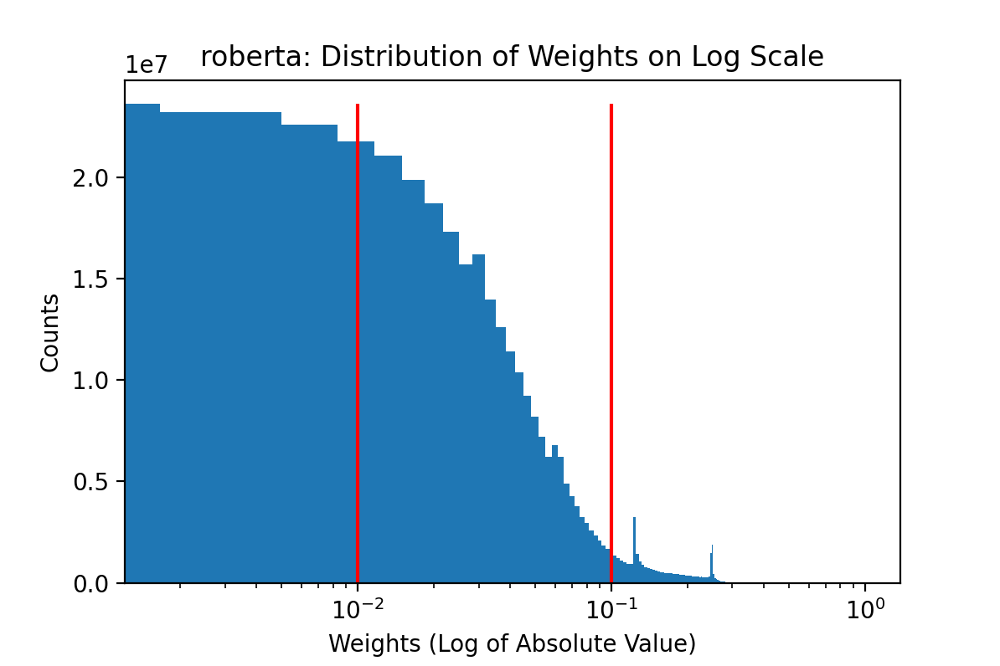
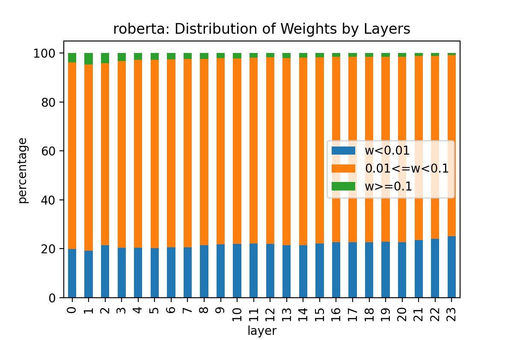
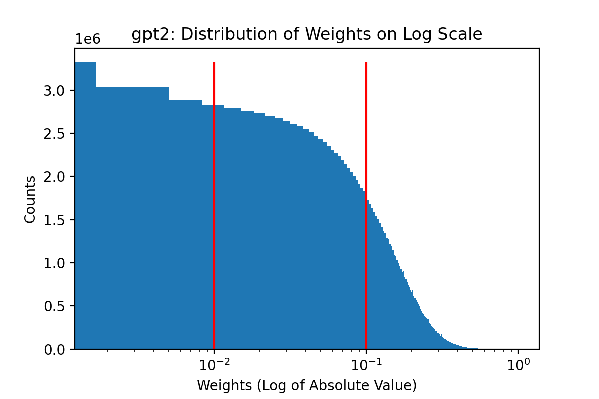
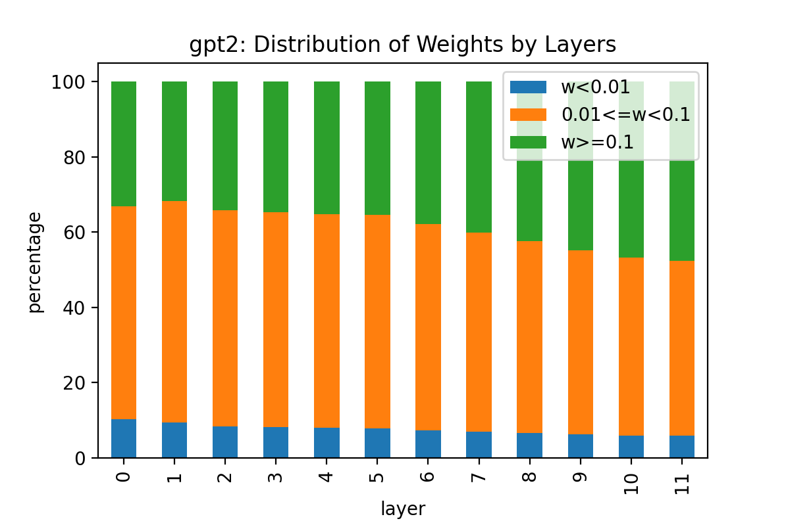

# LAB 4: LLM Sparsity

## Model Selection
* Encoder-Only: RoBERTa
* Decoder-Only: GPT-2
* Encoder-Decoder: BART

## Sparsity Structure Assessement

`sparsity_analysis.ipynb` gives code resource for this assessment.

### Distribution of Weights

This section studies the disitribution of weights on selected models.

#### RoBERTa

The weights of RoBERTa is normally distributed. Overall, around 90% of weights are less than 0.1, with about 20% of weights less than 0.01. The rest 10% of weights are greater than 0.1.

This pattern is reflected on each layer's sparsity structure while we observed a trend that as layer proceeds, the percentage of weights greater than 0.1 decreases while the percentage of weights less than 0.01 increases.

#### GPT-2

The weights of RoBERTa is normally distributed. Overall, around 58% of weights are less than 0.1, with about 7% of weights less than 0.01. The rest 42% of weghts are greater than 0.1.

This pattern is reflected on each layer's sparsity structure while we observed a trend that as layer proceeds, the percentage of weights greater than 0.1 increases while the percentage of weights between 0.01 and 0.1 decreases.

