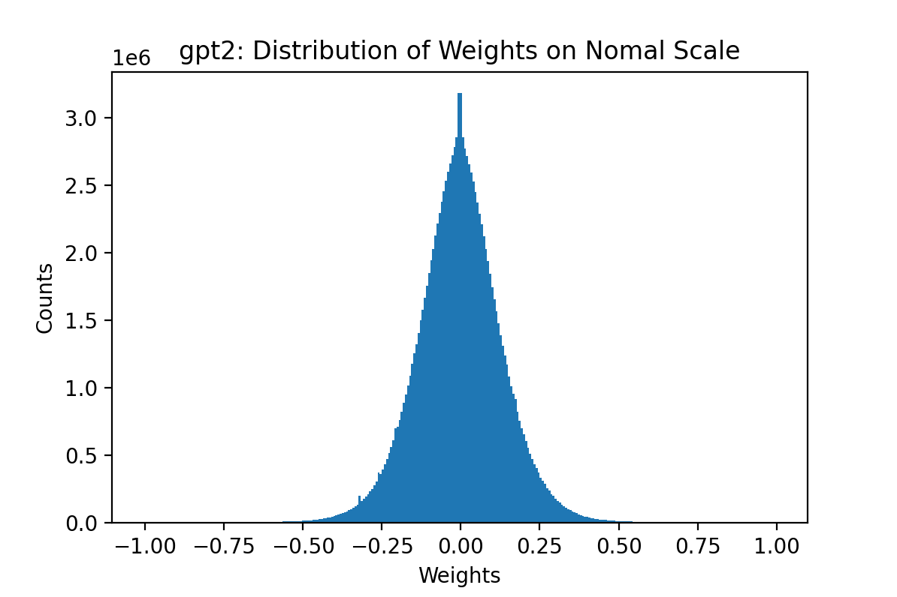
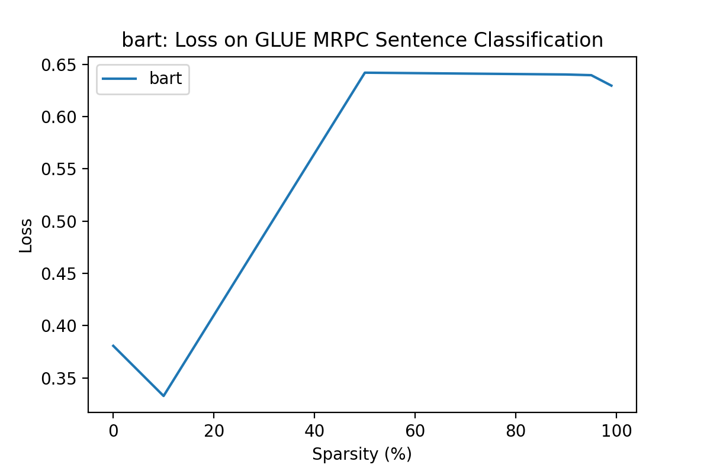
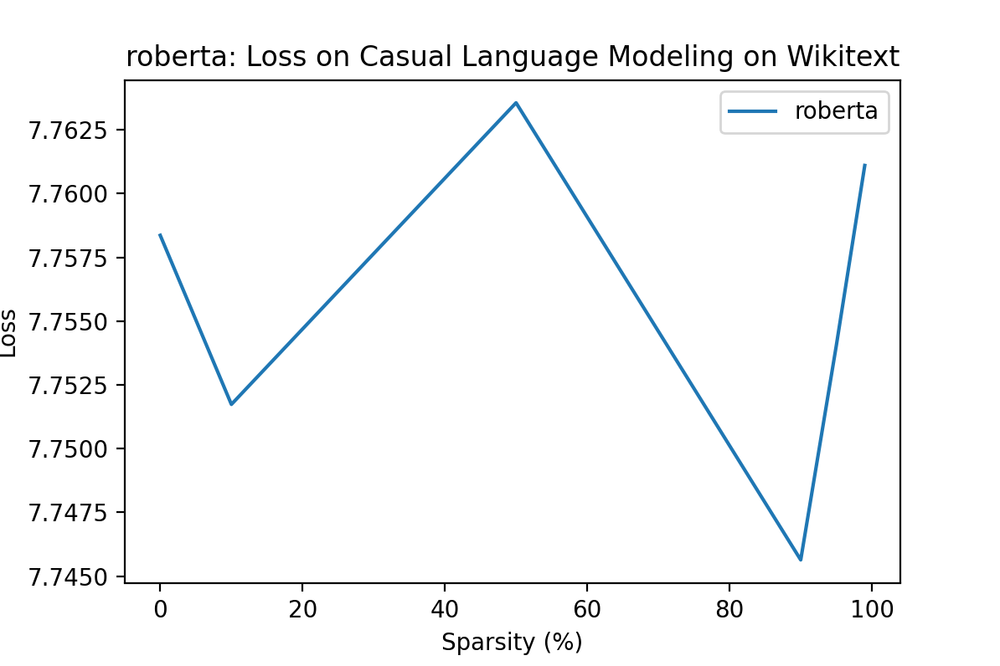
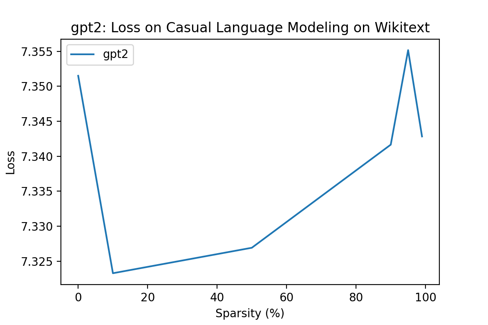
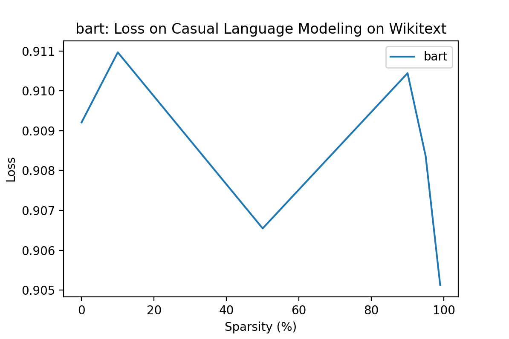

# LAB 4: LLM Sparsity

## Model Selection
* Encoder-Only: RoBERTa
* Decoder-Only: GPT-2
* Encoder-Decoder: BART

## Sparsity Structure Assessement

`sparsity_analysis.ipynb` provides code resource for this assessment.

### Distribution of Weights

This section studies the disitribution of weights on selected models.

#### RoBERTa

The weights of RoBERTa is normally distributed. Overall, around 90% of weights are less than 0.1, with about 20% of weights less than 0.01. The rest 10% of weights are greater than 0.1.

This pattern is reflected on each layer's sparsity structure while we observed a trend that as layer proceeds, the percentage of weights greater than 0.1 slightly decreases while the percentage of weights less than 0.01 slightly increases.

#### GPT-2

The weights of GPT-2 is normally distributed. Overall, around 58% of weights are less than 0.1, with about 7% of weights less than 0.01. The rest 42% of weghts are greater than 0.1.

This pattern is reflected on each layer's sparsity structure while we observed a trend that as layer proceeds, the percentage of weights greater than 0.1 slightly increases while the percentage of weights between 0.01 and 0.1 slightly decreases.

#### BART

The weights of BART is normally distributed. Overall, around 90% of weights are less than 0.1, with about 17% of weights less than 0.01. The rest 10% of weghts are greater than 0.1.

This pattern is reflected on each encoder layer's sparsity structure while we observed a trend that as layer proceeds, the percentage of weights greater than 0.1 slightly decreases while the percentage of weights less than 0.01 slightly increases. The distribution of weights per decoder layer is relatively stable. That is, the percentage of weights on each threshold doesn't change much across decoder layers.

## Sparsifying Models

`sparsify_models.py` provides code resource for the sparsification.

The selected models are sparsified based on required levels: [10%, 50%, 90%, 95%, 99%]. The [unstructured global pruning](https://pytorch.org/docs/stable/generated/torch.nn.utils.prune.global_unstructured.html) method is applied for the sparsification. As we observed that the selected 3 models follow similar pattern of weights distribution per layer, global pruning method should be proper in this setting.

## Benchmarks

`performance.ipynb` provides code resource for the performance analysis.

### GLUE
The first benchmark performed is [GLUE, the General Language Understanding Evaluation](https://huggingface.co/datasets/glue), on MRPC (The Microsoft Research Paraphrase Corpus). This task aims to test a model's ability to correctly classify a sentence pair if they have the same meaning. 

For RoBERTa, the loss increases as the model sparsity goes up to 50%. After that, the loss decreases as the model sparsity continues going up.

For GPT2, the loss increases in general as the model sparsity goes up. However, the growth speed of loss slows down as the model sparsity goes over 50%.

For BART, the loss increases as the model sparsity goes up to 50%. After that, the loss becomes stable as the model sparsity continues going up.

### CLM
The second benchmark performed is [CLM, Casual Language Modeling](https://huggingface.co/datasets/wikitext), on Wikitext. This task aims to test a model's ability to generate the next word based on the given corpus.

For RoBERTa, the loss generally fluctuates. The loss appears to be the lowest when the model is 90% sparse. The loss at 10% sparsity level is lower than the baseline loss (without sparsification).  

For GPT2, the loss increases in general as the model sparsity goes up while there is decrease in loss observered when sparsity level goes from 0% to 10% and from 95% to 99%.

For BART, the loss generally fluctuates. The loss reaches the lowest when the model is 99% sparse. The loss is also low when the model is 50% sparse.

**Analysis**: From both benchmark tests, we can relatively easily generalize GPT-2's performance while some bizarre behaviours are observed in other two models. I think this is due to the difference of sparsity structure between GPT-2 and other two models. Since GPT-2 has roughly 50% of weights that are greater than 0.1 while only 10% of weights in other two models are greater than 0.1. This may imply that GPT-2 is more likely to be affected by the sparsification than RoBERTa and BART. 

## Runtime & Model Size

**Runtime**: All models on both benchmarks appear to require less runtime as the model is sparsified at some level. However, we also notice that the difference in runtime between the original model and any sparsified model goes over 10 seconds. This implies that on a larger scale, sparsification doesn't save much time. One reason could be that the global pruning method provided by Pytorch is not acutally getting rid of selected weights rather than masking them to 0. Thus, the time complexity for matrix operations remains the same.

**Model Size**: As mentioned above, the global pruning isn't removing selected weights rather than masking them to 0. Therefore, the model size between the original model and any sparsified model remains the same.

### Runtime on GLUE

### Runtime on CLM

### Model Size

## Challenges of Sparsification

Based on the analysis from previous sections, we can see that GPT-2, compared to RoBERTa and BART, is more likely to behave as expected after sparsification. This is likely due to the fact that GPT-2 has more weights whose value is greater than 0.1 in its structure. than other two models. RoBERTa and BART, on the other hand, both have 90% of weights less than 0.1 in their structures. In this experiment, a model with more "small weights" appears to be more vulnerable to sparsification. That is, this model tends to behave unexpectly and stochastically and hard to conclude that sparsification does good to this model. This may imply that these large amount of "small weights", part of or all, that we wish to sparsify out may serve to model that we don't completely understand. Therefore, it's chanllanging to identify who the weights are that we can safely remove without affecting the performance of the model.

Secondly, in this experiment, model runtime is only saved by a small amount and model size is not saved at all through sparsification. Therefore, the support for sparsification on hardware level is also challenging as it may lead to the re-design of state-of-the-art hardwares used to train models. This is costly in both time and capital manners.